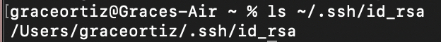

# Lab 2 #
### Grace Ortiz ###
## Part 1 ##
```
import java.io.IOException;
import java.net.URI;
import java.util.ArrayList;

class Handler implements URLHandler {

    private String searchList = "";
    private int count = 1;

    public String handleRequest(URI url) {

        String query = url.getQuery();

        if (url.getPath().equals("/")) {
            return "Add a message!";
        }
        else if (url.getPath().contains("/add-message")) { 
            if (query.equals(null) || !query.startsWith("s=")){
                return "Add a message after s= ";
            }
            else {
                String message = query.substring(2);
                searchList += String.format("%d. %s\n", count, message);
                count++;
                return searchList;
            }
        }

        else {
            if (url.getPath().equals("/clear")) {
                searchList = "";
                count = 1;
                return searchList;
            }
            return "404 Not Found!";
        }
    } 
}


class StringServer {
    public static void main(String[] args) throws IOException {
        if(args.length == 0){
            System.out.println("Missing port number! Try any number between 1024 to 49151");
            return;
        }

        int port = Integer.parseInt(args[0]);

        Server.start(port, new Handler());
    }
}
```
Here is me using add-message a few times with the example searches:

* First the main method of the StringServer class is called, which calls the Handler class, running the initialization of serachList, count, and message and then the handleRequest method. The relevant argument for the main method of StringServer is the port number.
* The relevant argument for the handleRequest method is the url of the site/server. Upon inititalization, the value of URI is [](https://0-0-0-0-3000-5qvda9t3k70pqq30rph2i4uo8o.us.edusercontent.com), the value of searchList is and empty string, the value of count is 1, and the value of message is and empty string.
* After adding the first search query, the message is given a value of "Hello". The searchList value changes to "1(the value of count). Hello (the value of message)\n" and then count is incremented by 1 to equal 2. Then the query is changed to "?s=How are you?" changing the URI value to [](https://0-0-0-0-3000-5qvda9t3k70pqq30rph2i4uo8o.us.edusercontent.com/add-message?s=How%20are%20you?), the message value to "How are you?", the searchList value to "1. Hello\n2. How are you?\n" and then the count is incremented by 1 to equal 3. 

And here is a couple more searches I made after clearing the search list:

* The handleRequest method is called again when its argument (URI) is changed.
* As stated above, the argument for the handleRequest method is the url (URI). The value of URI is still [](https://0-0-0-0-3000-5qvda9t3k70pqq30rph2i4uo8o.us.edusercontent.com/add-message?s=How%20are%20you?). All other fields retain their values from the previous screen shot.
* When the path is changed to /clear, the value of URI is changed to [](https://0-0-0-0-3000-5qvda9t3k70pqq30rph2i4uo8o.us.edusercontent.com/clear), the value of searchList is changed back to an empty string, and the value of count is changed to 1. After adding the first search query, the message is changed to "I have now cleared the list", the searchList value is changed to "1. I have now cleared the list\n", and the value of count increments by one and changes to 2. Then the query is changed to "?s=This is a new item", changing the URI value to [](https://0-0-0-0-3000-5qvda9t3k70pqq30rph2i4uo8o.us.edusercontent.com/add-message?s=This%20is%20a%20new%20item.), the value of message to "This is a new item.", the value of searchList to "1. I have now cleared the list\n2. This is a new item.\n", and incrementing the count changing it to 3. 

## Part 2 ##
Screenshot of the path to the private key for my SSH key:  
  
Screenshot of the path to the public key for my SSH key:  
  
Screenshot of login without password:  
  

## Part 3 ##
Before this week I didn't know about secure shell protocol or how remotely connecting to servers worked. I also thoguht it was interesting learning how to make the SSH key and am now able to login without a password! Using curl instead of git clone is also something new and I think it is nice to know multiple ways to download things from a url. 
