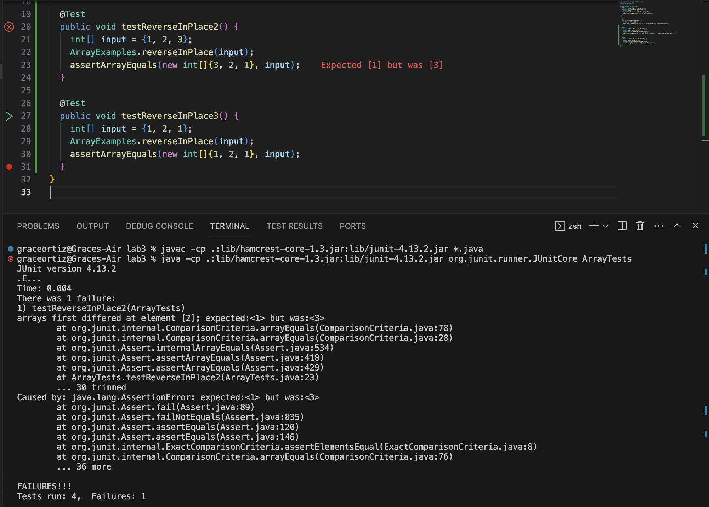
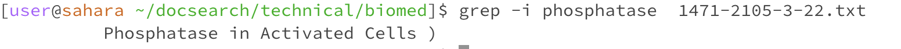
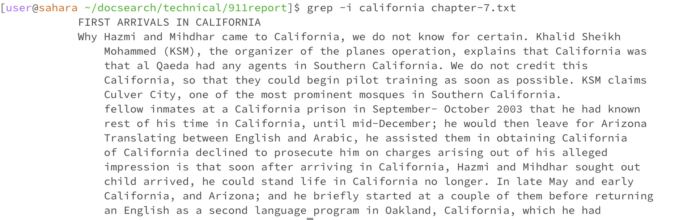
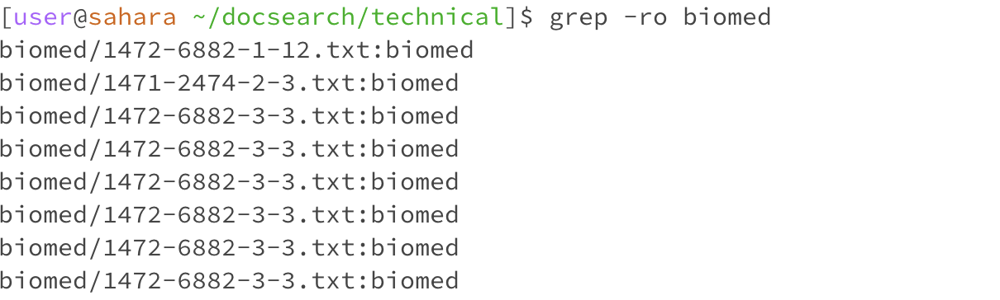
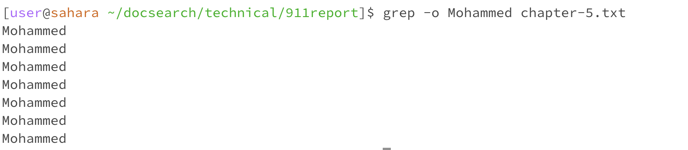
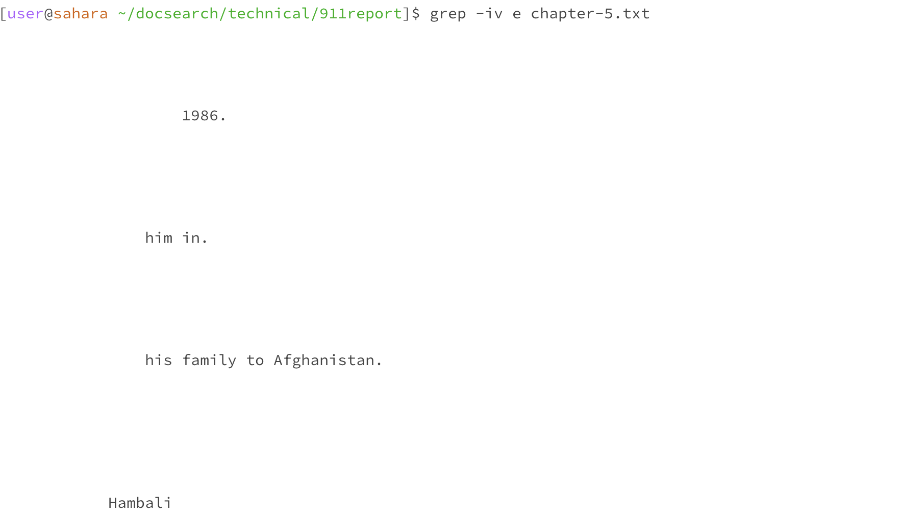
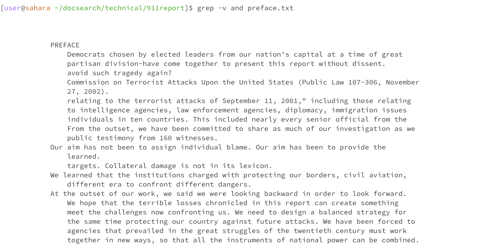
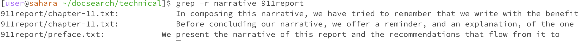
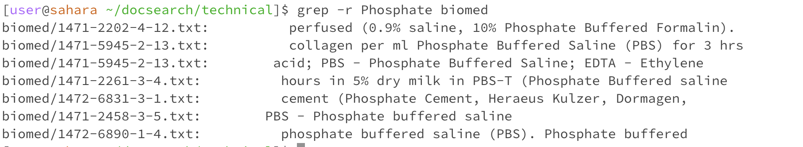

# Lab 3 #
### Grace Ortiz ###
## Part 1 - Bugs##

From the Week 4 Lab, I chose the reversedInPlace bug in ArrayExamples.java.   

A failure inducing input: 
```
@Test
  public void testReverseInPlace2() {
    int[] input = {1, 2, 3};
    ArrayExamples.reverseInPlace(input); 
    assertArrayEquals(new int[]{3, 2, 1}, input);
  }
```

An input that doesn't induce failure:
```
@Test
  public void testReverseInPlace3() {
    int[] input = {1, 2, 1};
    ArrayExamples.reverseInPlace(input); 
    assertArrayEquals(new int[]{1, 2, 1}, input);
  }
```   

The symptom:
   

The bug, before: 
```
static void reverseInPlace(int[] arr) {
    for(int i = 0; i < arr.length; i += 1) {
      arr[i] = arr[arr.length - i - 1];
    }
  }
```   

The bug, fixed:
```
static void reverseInPlace(int[] arr) {
    for(int i = 0; i < (arr.length/2); i += 1) {
      int temp = arr[i];
      arr[i] = arr[arr.length - i - 1];
      arr[arr.length - i - 1] = temp;
    }
  }
```

The fix addresses the issue because before, the method did not save the initial value of arr[i] and it got replaced and its value lost. It also traversed the whole array, overwriting swapping back valued that were already reversed. By changing the condition in the for loop to arr.length/2 it ensures that only half of the array is traversed, not re-swapping any already reversed data. By creating the temp variable, it saves the value of arr[i] so it can be reassigned and swapped effectively.   

## Part 2 - Researching Commands ##
4 command line options for **grep**:
- -i: ignore case (found through man grep command)
  -  ignores case when searching for matching lines
    
    
- -o: only matching (found through man grep command)
  - prints only the matching part of the line
    
    
- -v: invert (found through man grep command)
  - selected lines are those that do NOT match
    
    
- -r recursive (found through man grep)
  - recursively searches through all subdirectories
    
    
