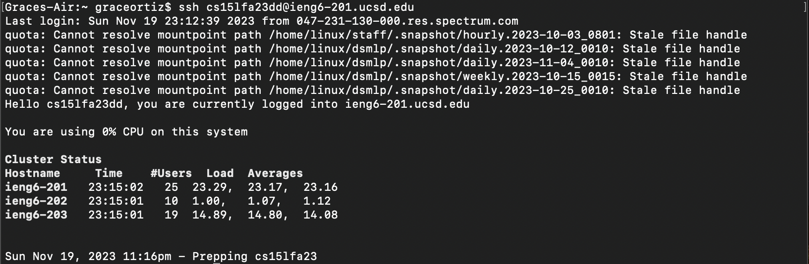
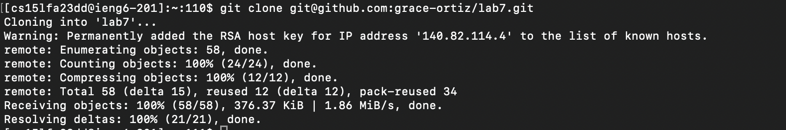
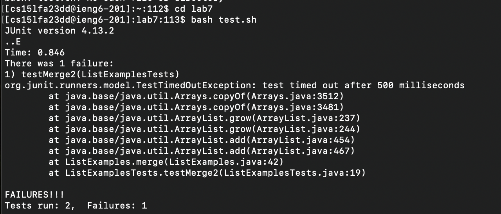
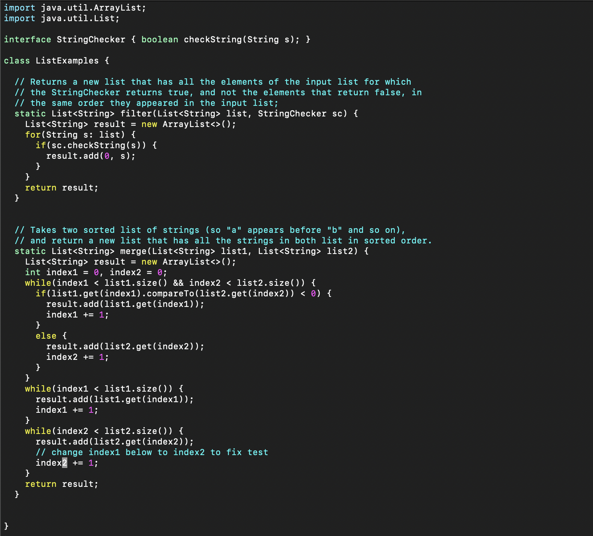
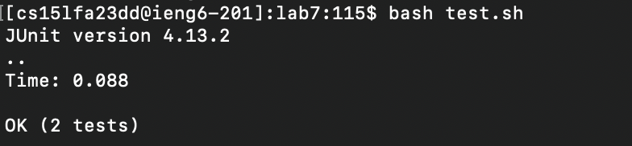
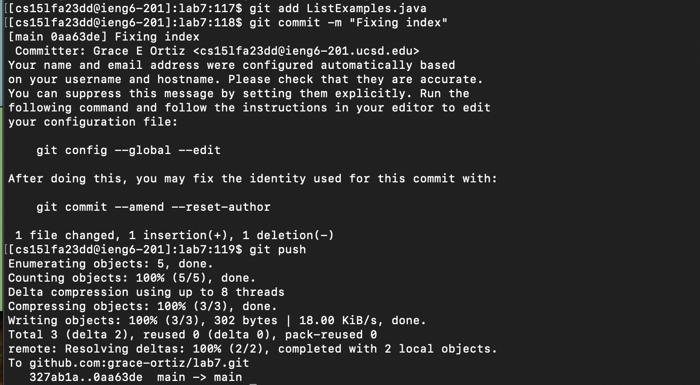

# Lab Report 4 #
### Grace Ortiz ###

### Step 1: Log into your ieng6 account ### 
   
Keystrokes: ```<up><enter>```
The ```ssh cs15lfa23dd@ieng6-201.ucsd.edu``` command was 1 up in the search history, so I pressed the ```up``` key 1 time and then ```enter``` to run the command. 
The ```ssh``` command provides a secure encrypted connection between my local computer and my account on ieng6-201.   

### Step 2: Clone your fork of the repository from your Github account (using the SSH URL) ###   
   
Keystrokes: ```<up><up><up><up><up><enter>```  
The ```git clone git@github.com:grace-ortiz/lab7.git``` command was up 5 in the search history, so I pressed the up key 5 times and then ```enter``` to run the command.       
The ```git clone``` command clones the specified repository into the working directory. The specified repsoitory is a fork that was cloned using an SSH key. 

### Step 3: Run the tests, demonstrating that they fail ### 
     
Keystrokes: ```cd lab7<enter>bash test.sh<enter>```  
The ```cd``` command changes the working directory to the specfied one (lab7) and ```enter``` runs the command. ```bash test.sh``` runs the test.sh file, which contains JUnit tests, and outputs how many tests passed and failed. Once again, ```enter``` runs the command. 

### Step 4: Edit the code file to fix the failing test ###    
   
Keystrokes: ```vim L<tab>.java<enter><up><up><up><up><up><up><right><right><right><right><right><right><right><right><right><right>xi2<esc>:wq<enter>```  
The ```vim``` command will open a specified file in the terminal in a text editing format. The specified file (ListExamples.java) is inputted by pressing L```tab```.java; the ```tab``` autofills the rest of the text that is unique up to the point of mulitple possibilities, where we must type .java. ```enter``` runs the command and the text editor is opened. We now must traverse the rows to find the bug in the code by going ```up``` 6 and ```right``` 10. The ```x``` deletes the character that the cursor is currently on, the ```i``` chnages the mode to insert mode, where we then insert '2' to fix the code. the ```esc``` key changes the mode back to normal mode. To save and exit, the ```:wq``` command is used, followed by ```enter``` to run it. 

### Step 5: Run the tests, demonstrating that they now succeed ###    
     
Keystrokes: ```<up><up><enter>```        
The ```bash test.sh``` command was 2 up in the search history, so I pressed the ```up``` key 2 times and then ```enter``` to run the command.  
As stated above, the ```bash test.sh``` command runs the test.sh file, which contains JUnit tests, and outputs how many tests passed and failed and ```enter``` runs the command. This time all the tests passed. 

### Step 6: Commit and push the resulting change to your Github account ###      
     
Keystrokes: ```git add ListExamples.java<enter>git commit -m "Fixing index"<enter>git push<enter>```     
The ```git add``` command adds stages the changes of the specifed file (ListExamples.java) to be committed (if you want to add all the files you can use '.'). ```git commit -m``` commits those changes to your local repository with a message that must be enclosed in quotations that should summarize the changes made. ```git push``` pushes those changes to the remote repository in GitHub. As per usual, ```enter``` runs the given command. 


