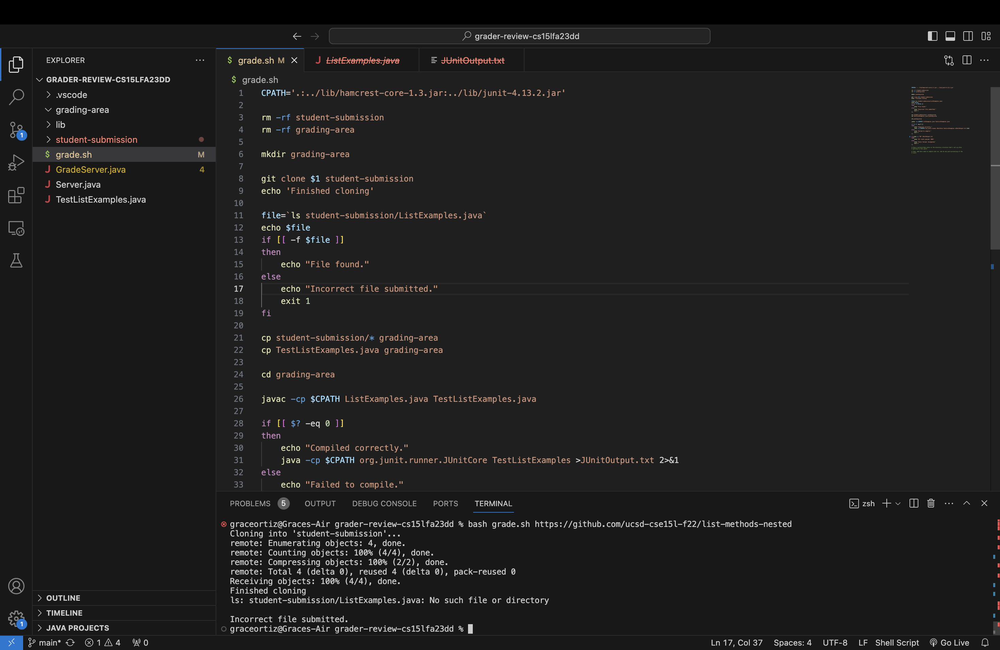
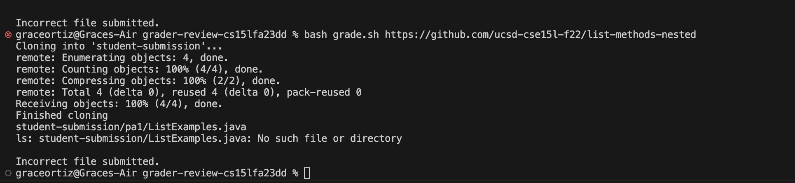

# Lab 5 #
### Grace Ortiz ###
## Part 1 - Debugging Scenario ###

### Post from student: ###


Hello,
I am trying to work on the Week 6 autograder, but I keep getting "Incorrect file submitted" when I know
that the file exists. It says there is no such file or directory, but it was working for a couple
other versions of the students' code, and I double checked that this version has the file. 
Thanks!



### TA response: ###

Hey! I suggest taking a look at the file structure of the student's submission and ensuring your grader
is compatible with different file structures. I think you'll find the -name option of the find command useful. 


### Student's response: ###

Oh I see! I used the find -name command and had it print out just before the grader searched for the desired file.
Since it is in a nested directory, the ls command wasn't finding it as a child of the student-submissions directory. 
This didn't show up earlier, because the files I was testing didn't have a nested structure. 


### The Setup ###

#### File structure: ####
```
- grader-review-cs15lfa23dd
  - grading-area
  - lib
    - hamcrest-core-1.3.jar
    - junit-4.13.2.jar
  - student-submission
  - grade.sh
  - GradeServer.java
  - Server.java
  - TestListExamples.java
```

#### Contents before fixing the bug: ####
**grade.sh**
```
CPATH='.:../lib/hamcrest-core-1.3.jar:../lib/junit-4.13.2.jar'

rm -rf student-submission
rm -rf grading-area

mkdir grading-area

git clone $1 student-submission
echo 'Finished cloning'

file=`ls student-submission/ListExamples.java`
echo $file
if [[ -f $file ]]
then
    echo "File found."
else 
    echo "Incorrect file submitted."
    exit 1
fi

cp student-submission/* grading-area 
cp TestListExamples.java grading-area

cd grading-area

javac -cp $CPATH ListExamples.java TestListExamples.java

if [[ $? -eq 0 ]]
then 
    echo "Compiled correctly."
    java -cp $CPATH org.junit.runner.JUnitCore TestListExamples >JUnitOutput.txt 2>&1
else 
    echo "Failed to compile."
    exit 1
fi 

if grep -q "OK" JUnitOutput.txt
then 
    echo "All tests passed: 100%"
else 
    echo "Tests failed: Incomplete"
    exit 1
fi
```
**GradeServer.java**
```
import java.io.BufferedReader;
import java.io.IOException;
import java.io.InputStream;
import java.io.InputStreamReader;
import java.net.URI;
import java.net.URISyntaxException;
import java.util.Arrays;
import java.util.stream.Stream;

class ExecHelpers {

  /**
    Takes an input stream, reads the full stream, and returns the result as a
    string.

    In Java 9 and later, new String(out.readAllBytes()) would be a better
    option, but using Java 8 for compatibility with ieng6.
  */
  static String streamToString(InputStream out) throws IOException {
    String result = "";
    while(true) {
      int c = out.read();
      if(c == -1) { break; }
      result += (char)c;
    }
    return result;
  }

  /**
    Takes a command, represented as an array of strings as it would by typed at
    the command line, runs it, and returns its combined stdout and stderr as a
    string.
  */
  static String exec(String[] cmd) throws IOException {
    Process p = new ProcessBuilder()
                    .command(Arrays.asList(cmd))
                    .redirectErrorStream(true)
                    .start();
    InputStream outputOfBash = p.getInputStream();
    return String.format("%s\n", streamToString(outputOfBash));
  }

}

class Handler implements URLHandler {
    public String handleRequest(URI url) throws IOException {
       if (url.getPath().equals("/grade")) {
           String[] parameters = url.getQuery().split("=");
           if (parameters[0].equals("repo")) {
               String[] cmd = {"bash", "grade.sh", parameters[1]};
               String result = ExecHelpers.exec(cmd);
               return result;
           }
           else {
               return "Couldn't find query parameter repo";
           }
       }
       else {
           return "Don't know how to handle that path!";
       }
    }
}

class GradeServer {
    public static void main(String[] args) throws IOException {
        if(args.length == 0){
            System.out.println("Missing port number! Try any number between 1024 to 49151");
            return;
        }

        int port = Integer.parseInt(args[0]);

        Server.start(port, new Handler());
    }
}

class ExecExamples {
  public static void main(String[] args) throws IOException {
    String[] cmd1 = {"ls", "lib"};
    System.out.println(ExecHelpers.exec(cmd1));

    String[] cmd2 = {"pwd"};
    System.out.println(ExecHelpers.exec(cmd2));

    String[] cmd3 = {"touch", "a-new-file.txt"};
    System.out.println(ExecHelpers.exec(cmd3));
  }
}
```
**Server.java**
```
import java.io.IOException;
import java.io.OutputStream;
import java.net.InetSocketAddress;
import java.net.URI;

import com.sun.net.httpserver.HttpExchange;
import com.sun.net.httpserver.HttpHandler;
import com.sun.net.httpserver.HttpServer;

interface URLHandler {
    String handleRequest(URI url) throws IOException;
}

class ServerHttpHandler implements HttpHandler {
    URLHandler handler;
    ServerHttpHandler(URLHandler handler) {
      this.handler = handler;
    }
    public void handle(final HttpExchange exchange) throws IOException {
        // form return body after being handled by program
        try {
            String ret = handler.handleRequest(exchange.getRequestURI());
            // form the return string and write it on the browser
            exchange.sendResponseHeaders(200, ret.getBytes().length);
            OutputStream os = exchange.getResponseBody();
            os.write(ret.getBytes());
            os.close();
        } catch(Exception e) {
            String response = e.toString();
            exchange.sendResponseHeaders(500, response.getBytes().length);
            OutputStream os = exchange.getResponseBody();
            os.write(response.getBytes());
            os.close();
        }
    }
}

public class Server {
    public static void start(int port, URLHandler handler) throws IOException {
        HttpServer server = HttpServer.create(new InetSocketAddress(port), 0);

        //create request entrypoint
        server.createContext("/", new ServerHttpHandler(handler));

        //start the server
        server.start();
        System.out.println("Server Started! Visit http://localhost:" + port + " to visit.");
    }
}
```
**TestListExamples.java**
```
import static org.junit.Assert.*;
import org.junit.*;
import java.util.Arrays;
import java.util.List;

class IsMoon implements StringChecker {
  public boolean checkString(String s) {
    return s.equalsIgnoreCase("moon");
  }
}

public class TestListExamples {
  @Test(timeout = 500)
  public void testMergeRightEnd() {
    List<String> left = Arrays.asList("a", "b", "c");
    List<String> right = Arrays.asList("a", "d");
    List<String> merged = ListExamples.merge(left, right);
    List<String> expected = Arrays.asList("a", "a", "b", "c", "d");
    assertEquals(expected, merged);
  }
}
```

#### Command to trigger bug ####
```
bash grade.sh https://github.com/ucsd-cse15l-f22/list-methods-nested
```

#### What to fix ####
Instead of using ```ls student-submission/ListExamples.java``` to find the desired file, I used ```find student-submission -name ListExamples.java```. 
Since this allowed me to find the desired file regardless of file structure, I also ensured that it would be copied to the grading area correctly
by changing ```cp student-submission/* grading-area``` to ```cp $file grading-area```.


## Part 2 - Reflection ##

I thought learning about vim and how to edit files in the terminal was really cool! It was something I had tried to do in the past but always found it frustrating how there wasn't a simple way, so it was really nice to be able to learn it. While its a little tricky with all of its seemingly radnom key commands, it's one of the most useful thongs I have learned in this class, besides bash.

